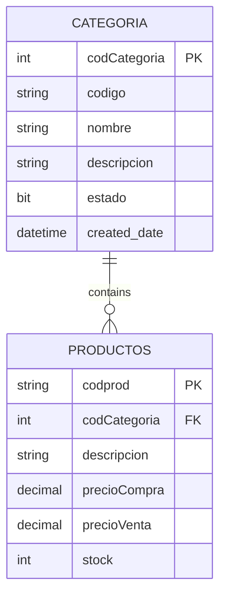

## Overview

The Categories module enables you to organize products into logical groups for better inventory management, reporting, and navigation. Each product in the system can be assigned to a category for classification.

## Category Entity

Categories are stored in the `categoria` table with the following properties:

<ResponseField name="CodCategoria" type="int" required>
  Unique identifier for the category (auto-incremented primary key)
</ResponseField>

<ResponseField name="Codigo" type="string" required>
  Category code (max 20 characters). Must be unique across all categories.
</ResponseField>

<ResponseField name="Nombre" type="string" required>
  Category name (max 150 characters)
</ResponseField>

<ResponseField name="Descripcion" type="string">
  Detailed description of the category (max 300 characters)
</ResponseField>

<ResponseField name="Estado" type="bool">
  Indicates whether the category is active (defaults to `true`)
</ResponseField>

<ResponseField name="CreatedDate" type="DateTime">
  Timestamp when the category was created (defaults to current date/time)
</ResponseField>

## Database Schema

```sql
CREATE TABLE categoria(
    codCategoria INT IDENTITY(1,1) PRIMARY KEY,
    codigo VARCHAR(20) NOT NULL UNIQUE,
    nombre VARCHAR(150) NOT NULL,
    descripcion VARCHAR(300),
    estado BIT DEFAULT 1,
    created_date DATETIME DEFAULT GETDATE()
)
```

## Indexes

The categories table includes optimized indexes for performance:

- **IDX_categoria_codigo**: Unique index on `codigo` field for fast lookups and duplicate prevention
- **IDX_categoria_nombre**: Index on `nombre` for efficient name-based searches
- **IDX_categoria_estado**: Index on `estado` to quickly filter active/inactive categories

## Category-Product Relationship

Categories have a one-to-many relationship with products:



<CardGroup cols={2}>
  <Card title="One-to-Many" icon="folder-tree">
    A single category can contain multiple products. Products reference categories via the `codCategoria` foreign key.
  </Card>
  <Card title="Optional Assignment" icon="link-slash">
    Products can exist without a category assignment (`codCategoria` is nullable in the products table).
  </Card>
</CardGroup>

## Category Operations

### Creating Categories

When creating a new category:

<Steps>
  <Step title="Assign Unique Code">
    Provide a unique `Codigo` (max 20 characters) that identifies the category
  </Step>
  
  <Step title="Define Name">
    Enter a descriptive `Nombre` that clearly indicates what products belong in this category
  </Step>
  
  <Step title="Add Description">
    Optionally provide a `Descripcion` to give more context about what products fit this category
  </Step>
  
  <Step title="Set Status">
    Leave `Estado` as `true` (default) to make the category active immediately
  </Step>
</Steps>

<Tip>
  Use consistent code formats for better organization, such as:
  - CAT-ELEC for Electronics
  - CAT-FOOD for Food Items
  - CAT-FURN for Furniture
  - CAT-CLTH for Clothing
</Tip>

### Category Code Examples

<CodeGroup>
```json Electronics
{
  "Codigo": "CAT-001",
  "Nombre": "Electronics",
  "Descripcion": "Electronic devices, components, and accessories",
  "Estado": true
}
```

```json Office Supplies
{
  "Codigo": "CAT-002",
  "Nombre": "Office Supplies",
  "Descripcion": "Stationery, paper products, and office equipment",
  "Estado": true
}
```

```json Hardware
{
  "Codigo": "CAT-003",
  "Nombre": "Hardware",
  "Descripcion": "Tools, fasteners, and construction materials",
  "Estado": true
}
```
</CodeGroup>

### Enabling/Disabling Categories

Categories can be deactivated without deletion:

- **Active** (`Estado = 1`): Category appears in product selection and reports
- **Inactive** (`Estado = 0`): Category is hidden but existing product associations remain

<Note>
  Disabling a category does not affect existing products assigned to it. Products retain their category assignment even when the category is inactive.
</Note>

### Deleting Categories

<Warning>
  Categories that have products assigned to them are protected by the foreign key relationship. Before deleting a category:
  1. Reassign all products to different categories, or
  2. Set product `codCategoria` to NULL, or
  3. Disable the category instead using `Estado = 0`
</Warning>

## Model Reference

The C# model for Category (`TechCore.Models.Categorium`) includes:

```csharp
public partial class Categorium
{
    public int CodCategoria { get; set; }
    public string Codigo { get; set; } = null!;
    public string Nombre { get; set; } = null!;
    public string? Descripcion { get; set; }
    public bool? Estado { get; set; }
    public DateTime? CreatedDate { get; set; }

    // Navigation property
    public virtual ICollection<Producto> Productos { get; set; } = new List<Producto>();
}
```

<Info>
  The model uses the singular form `Categorium` following Entity Framework's naming conventions for the plural table name `categoria`.
</Info>

## Querying Categories

### Get All Active Categories

```sql
SELECT * FROM categoria WHERE estado = 1
ORDER BY nombre
```

### Get Categories with Product Count

```sql
SELECT 
    c.codCategoria,
    c.codigo,
    c.nombre,
    c.descripcion,
    COUNT(p.codprod) as TotalProducts
FROM categoria c
LEFT JOIN productos p ON c.codCategoria = p.codCategoria
WHERE c.estado = 1
GROUP BY c.codCategoria, c.codigo, c.nombre, c.descripcion
ORDER BY TotalProducts DESC
```

### Find Categories Without Products

```sql
SELECT c.*
FROM categoria c
LEFT JOIN productos p ON c.codCategoria = p.codCategoria
WHERE p.codprod IS NULL
AND c.estado = 1
```

## Reporting and Analytics

<AccordionGroup>
  <Accordion title="Inventory by Category">
    Generate reports showing stock levels, total value, and product counts grouped by category for inventory analysis.
  </Accordion>

  <Accordion title="Sales Performance by Category">
    Track which categories generate the most revenue by joining sales data with product categories.
  </Accordion>

  <Accordion title="Category Profitability">
    Calculate profit margins by comparing purchase prices (`precioCompra`) and sale prices (`precioVenta`) within each category.
  </Accordion>

  <Accordion title="Low Stock Alerts by Category">
    Monitor products that fall below minimum stock levels (`stockMinimo`) organized by category.
  </Accordion>
</AccordionGroup>

## Integration with Products

Products reference categories through the `codCategoria` foreign key:

```sql
CREATE TABLE productos(
    codprod VARCHAR(50) PRIMARY KEY,
    codCategoria INT NULL,
    descripcion VARCHAR(500),
    precioCompra DECIMAL(18,2) NOT NULL,
    precioVenta DECIMAL(18,2) NOT NULL,
    stock INT DEFAULT 0,
    stockMinimo INT DEFAULT 5,
    estado BIT DEFAULT 1,
    created_date DATETIME DEFAULT GETDATE(),
    CONSTRAINT FK_productos_categoria
    FOREIGN KEY (codCategoria) REFERENCES categoria(codCategoria)
)
```

## Best Practices

<CardGroup cols={2}>
  <Card title="Logical Grouping" icon="sitemap">
    Create categories that reflect how your business naturally organizes products. Avoid creating too many narrow categories.
  </Card>
  
  <Card title="Code Consistency" icon="barcode">
    Establish and follow a consistent format for category codes (e.g., CAT-XXX or CTG-XXXX).
  </Card>
  
  <Card title="Clear Descriptions" icon="file-lines">
    Write clear descriptions to help users understand what products belong in each category.
  </Card>
  
  <Card title="Regular Cleanup" icon="broom">
    Periodically review categories to merge duplicates or remove unused ones.
  </Card>
</CardGroup>

## Category Management Tips

<Tip>
  **Planning Categories**: Before creating categories, analyze your product inventory to identify natural groupings. Common approaches include:
  - By product type (Electronics, Furniture, Clothing)
  - By department (Hardware, Grocery, Pharmacy)
  - By supplier or brand
  - By price range or margin level
</Tip>

<Note>
  Categories help with:
  - Faster product searches and filtering
  - Organized inventory reports
  - Better analytics and sales insights
  - Simplified product management
  - Enhanced user navigation
</Note>