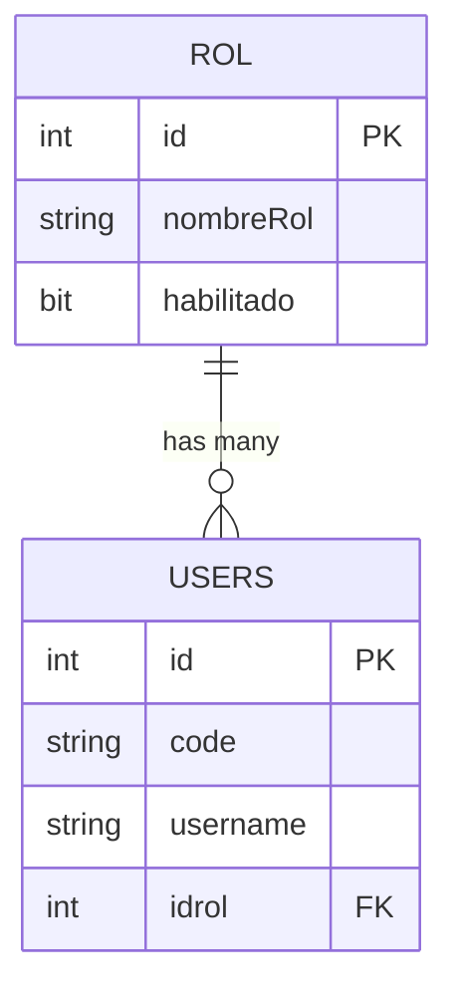

## Overview

TechCore Mini ERP implements a role-based access control system where each user is assigned to a role. Roles define the permissions and access levels that determine what actions users can perform within the system.

## Role Entity

Roles are stored in the `rol` table with the following properties:

<ResponseField name="Id" type="int" required>
  Unique identifier for the role (auto-incremented)
</ResponseField>

<ResponseField name="NombreRol" type="string" required>
  Name of the role (max 100 characters)
</ResponseField>

<ResponseField name="Habilitado" type="bool">
  Indicates whether the role is active/enabled (defaults to `true`)
</ResponseField>

## Database Schema

```sql
CREATE TABLE rol(
    id INT IDENTITY(1,1) PRIMARY KEY,
    nombreRol VARCHAR(100) NOT NULL,
    habilitado BIT DEFAULT 1
)
```

## Indexes

The roles table includes:

- **IDX_rol_habilitado**: Index on the `habilitado` field to efficiently filter active roles

## Role-User Relationship

Each role can be assigned to multiple users, establishing a one-to-many relationship:



<CardGroup cols={2}>
  <Card title="One-to-Many" icon="users">
    A single role can be assigned to multiple users in the system.
  </Card>
  <Card title="Required Assignment" icon="link">
    Every user must have a role assigned via the `idrol` foreign key constraint.
  </Card>
</CardGroup>

## Role Management

### Creating Roles

When creating a new role:

1. Define a clear, descriptive `NombreRol` (e.g., "Administrator", "Sales Manager", "Warehouse Staff")
2. Set `Habilitado` to `true` (or leave as default) to activate the role
3. Ensure the role name reflects the permissions it will grant

<Tip>
  Use descriptive role names that clearly indicate the level of access, such as:
  - Administrator
  - Sales Manager
  - Purchase Manager
  - Inventory Clerk
  - View Only
</Tip>

### Enabling/Disabling Roles

Roles can be enabled or disabled without deleting them:

- **Enabled** (`Habilitado = 1`): Users assigned to this role can access the system
- **Disabled** (`Habilitado = 0`): Users assigned to this role may have restricted access

<Warning>
  Disabling a role affects all users assigned to that role. Ensure you understand the impact before disabling a role that has active users.
</Warning>

### Deleting Roles

<Note>
  Roles cannot be deleted if they have associated users due to the foreign key constraint from the `users` table. You must either:
  - Reassign all users to different roles first, or
  - Disable the role using `Habilitado = 0`
</Note>

## Model Reference

The C# model for Role (`TechCore.Models.Rol`) includes:

```csharp
public partial class Rol
{
    public int Id { get; set; }
    public string NombreRol { get; set; } = null!;
    public bool? Habilitado { get; set; }

    // Navigation property
    public virtual ICollection<User> Users { get; set; } = new List<User>();
}
```

## Access Control Implementation

### Role-Based Authorization

The role system enables implementing authorization checks throughout the application:

<CodeGroup>
```csharp Controller Authorization
// Example: Restrict access based on role
if (currentUser.IdrolNavigation.NombreRol != "Administrator")
{
    return Forbid();
}
```

```csharp View-Level Authorization
// Example: Show/hide UI elements based on role
@if (User.IsInRole("Sales Manager"))
{
    <a href="/sales/create">Create New Sale</a>
}
```
</CodeGroup>

### Common Role Configurations

<AccordionGroup>
  <Accordion title="Administrator">
    Full access to all system features including:
    - User management
    - Role configuration
    - System settings
    - All business operations (sales, purchases, inventory)
    - Reports and analytics
  </Accordion>

  <Accordion title="Sales Manager">
    Access to sales-related features:
    - Create and manage sales orders
    - View customer information
    - Access sales reports
    - Manage credit sales and payment plans
  </Accordion>

  <Accordion title="Purchase Manager">
    Access to purchasing operations:
    - Create and manage purchase orders
    - Manage supplier information
    - View inventory levels
    - Access purchase reports
  </Accordion>

  <Accordion title="Warehouse Staff">
    Limited access to inventory functions:
    - View product information
    - Update stock levels
    - View stock alerts
    - Limited reporting capabilities
  </Accordion>

  <Accordion title="View Only">
    Read-only access:
    - View reports
    - View customer and product information
    - No create, update, or delete permissions
  </Accordion>
</AccordionGroup>

## Security Considerations

<Steps>
  <Step title="Principle of Least Privilege">
    Assign users only the minimum permissions required to perform their job functions
  </Step>
  
  <Step title="Regular Audits">
    Periodically review role assignments to ensure users have appropriate access levels
  </Step>
  
  <Step title="Separation of Duties">
    Avoid giving single roles excessive permissions that could lead to conflicts of interest
  </Step>
  
  <Step title="Monitor Disabled Roles">
    Track which roles are disabled and verify that associated users are appropriately handled
  </Step>
</Steps>

## Querying Roles

### Get All Active Roles

```sql
SELECT * FROM rol WHERE habilitado = 1
```

### Get Users by Role

```sql
SELECT u.id, u.code, u.nombre, u.username, r.nombreRol
FROM users u
INNER JOIN rol r ON u.idrol = r.id
WHERE r.nombreRol = 'Administrator'
AND r.habilitado = 1
```

### Count Users per Role

```sql
SELECT r.nombreRol, COUNT(u.id) as TotalUsers
FROM rol r
LEFT JOIN users u ON r.id = u.idrol
GROUP BY r.id, r.nombreRol
ORDER BY TotalUsers DESC
```

## Best Practices

<CardGroup cols={2}>
  <Card title="Role Naming" icon="tag">
    Use clear, business-oriented names that reflect job functions rather than technical permissions
  </Card>
  
  <Card title="Default Roles" icon="user-plus">
    Create a default role for new users with minimal permissions
  </Card>
  
  <Card title="Role Documentation" icon="book">
    Maintain documentation of what each role can access and perform
  </Card>
  
  <Card title="Testing" icon="flask">
    Test role permissions thoroughly before deploying to production
  </Card>
</CardGroup>