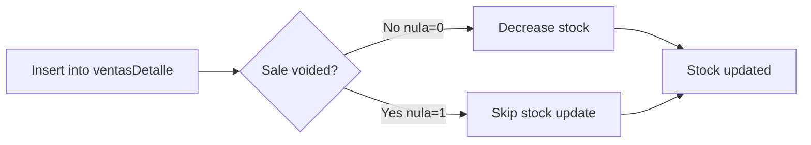
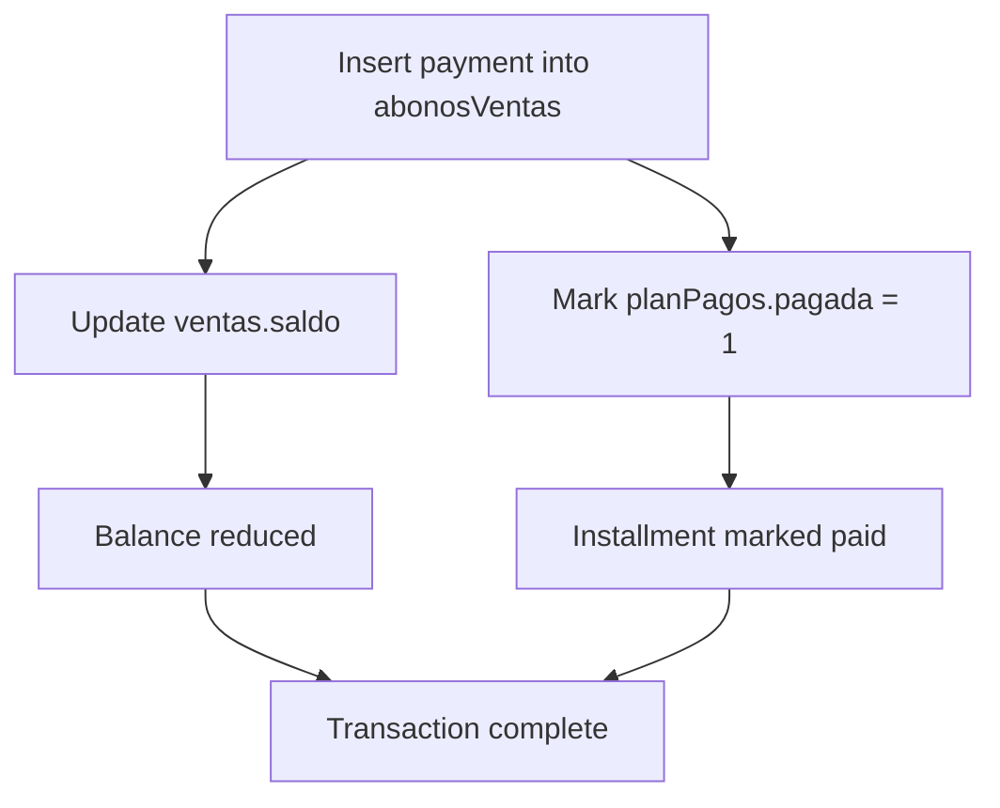

# Database Triggers

TechCore Mini ERP uses SQL Server triggers to automatically maintain data consistency across related tables. These triggers ensure that inventory levels and payment balances are updated in real-time without requiring manual intervention.

## TR_DisminuirStock

Automatically decreases product stock when sale items are added, but only for valid (non-voided) sales.

### Purpose
- Maintain accurate real-time inventory levels
- Prevent stock updates for voided transactions
- Eliminate manual stock adjustments after sales
- Ensure data integrity between sales and inventory

### SQL Definition

```sql
CREATE TRIGGER TR_DisminuirStock
ON ventasDetalle
AFTER INSERT
AS
BEgin
    UPDATE p
    SET p.stock = p.stock - i.cantidad
    FROM productos p
    INNER JOIN inserted i ON p.codprod = i.codprod
    INNER JOIN ventas v ON v.norden = i.norden
    WHERE v.nula = 0
END
GO
```

### How It Works

1. **Fires After**: New records are inserted into `ventasDetalle` table
2. **Checks Status**: Validates that the parent sale is not voided (`v.nula = 0`)
3. **Updates Stock**: Decreases product stock by the quantity sold
4. **Uses JOIN**: Links inserted items to products and validates against the sale header

<Note>
**Important**: This trigger only processes valid sales. If a sale is marked as voided (`nula = 1`), the stock will not be decreased. This prevents inventory discrepancies when transactions are canceled.
</Note>

### Trigger Flow



### Example Scenario

```sql
-- Initial product stock: 100 units
SELECT stock FROM productos WHERE codprod = 'PROD001'
-- Result: 100

-- Insert sale detail (triggers TR_DisminuirStock)
INSERT INTO ventasDetalle (norden, codprod, cantidad, pventa, subtotal)
VALUES ('V-2024-0001', 'PROD001', 15, 25.00, 375.00)

-- Stock automatically updated
SELECT stock FROM productos WHERE codprod = 'PROD001'
-- Result: 85 (100 - 15)
```

<Info>
The trigger uses the `inserted` pseudo-table, which contains the new rows being added. This allows the trigger to process one or multiple rows efficiently in a single operation.
</Info>

## TR_ActualizarSaldo

Automatically updates sale balances and marks installments as paid when payments are recorded.

### Purpose
- Update outstanding balance on credit sales
- Mark specific installments as paid
- Maintain synchronized payment records
- Automate accounts receivable management

### SQL Definition

```sql
CREATE TRIGGER TR_ActualizarSaldo
ON abonosVentas
AFTER INSERT
AS
BEGIN
    UPDATE v
    SET v.saldo = v.saldo - i.monto
    FROM ventas v
    INNER JOIN inserted i ON v.norden = i.norden

    UPDATE pp
    SET pagada = 1
    FROM planPagos pp
    INNER JOIN inserted i 
        ON pp.norden = i.norden 
        AND pp.numeroCuota = i.numeroCuota
END
GO
```

### How It Works

1. **Fires After**: New payment records are inserted into `abonosVentas` table
2. **Updates Balance**: Decreases the sale's outstanding balance (`saldo`) by the payment amount
3. **Marks Installment**: Sets the corresponding installment as paid (`pagada = 1`)
4. **Dual Action**: Performs both updates atomically in a single transaction

<Note>
**Key Behavior**: This trigger performs two critical updates:
1. Reduces the `saldo` field in the `ventas` table
2. Marks the installment as paid in the `planPagos` table

Both operations occur automatically, ensuring data consistency across tables.
</Note>

### Trigger Flow



### Example Scenario

```sql
-- Check sale balance and installment status
SELECT saldo FROM ventas WHERE norden = 'V-2024-0001'
-- Result: 1500.00

SELECT pagada FROM planPagos WHERE norden = 'V-2024-0001' AND numeroCuota = 1
-- Result: 0 (not paid)

-- Record a payment (triggers TR_ActualizarSaldo)
INSERT INTO abonosVentas (norden, monto, numeroCuota)
VALUES ('V-2024-0001', 500.00, 1)

-- Balance and installment status automatically updated
SELECT saldo FROM ventas WHERE norden = 'V-2024-0001'
-- Result: 1000.00 (1500 - 500)

SELECT pagada FROM planPagos WHERE norden = 'V-2024-0001' AND numeroCuota = 1
-- Result: 1 (marked as paid)
```

<Info>
When recording payments in the application layer, you only need to insert into `abonosVentas`. The trigger handles updating both the sale balance and installment status automatically.
</Info>

## Trigger Best Practices

### When Using These Triggers

1. **Never manually update stock** after creating sales - let the trigger handle it
2. **Always specify numeroCuota** when recording payments in `abonosVentas`
3. **Use transactions** when inserting sale details to ensure atomicity
4. **Monitor for errors** as trigger failures will rollback the entire operation

### Testing Triggers

```sql
-- Test stock decrease trigger
BEGIN TRANSACTION
    DECLARE @InitialStock INT
    SELECT @InitialStock = stock FROM productos WHERE codprod = 'TEST001'
    
    INSERT INTO ventasDetalle (norden, codprod, cantidad, pventa, subtotal)
    VALUES ('V-TEST-001', 'TEST001', 5, 10.00, 50.00)
    
    DECLARE @NewStock INT
    SELECT @NewStock = stock FROM productos WHERE codprod = 'TEST001'
    
    IF @NewStock = @InitialStock - 5
        PRINT 'Trigger working correctly'
    ELSE
        PRINT 'Trigger failed'
ROLLBACK TRANSACTION
```

### Error Handling

<Warning>
If a trigger fails, the entire operation is rolled back. Common failure scenarios:

- **TR_DisminuirStock**: Attempting to reduce stock below zero
- **TR_ActualizarSaldo**: Payment amount exceeds outstanding balance
- **Both triggers**: Foreign key violations or missing parent records

Always validate data before insert operations to prevent trigger failures.
</Warning>

## Performance Considerations

Both triggers are optimized for performance:

- Use set-based operations instead of cursors
- Leverage indexes on join columns (`norden`, `codprod`, `numeroCuota`)
- Execute AFTER INSERT (not INSTEAD OF) to allow batch processing
- Minimal logic keeps execution time low

## Related Topics

- [Views](/database/views) - Query credit sales and payment status
- [Indexes](/database/indexes) - Performance optimizations for trigger operations
- [Sales and Purchases](/database/tables/sales-purchases) - Table structures affected by triggers
- [Database Overview](/database/overview) - Entity relationships and architecture